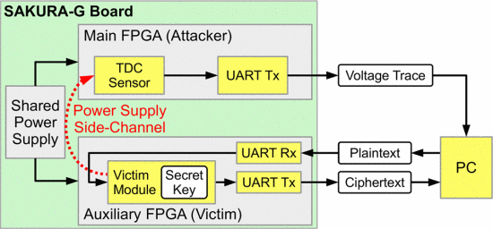
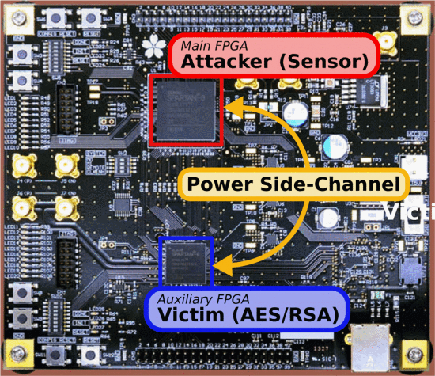

# Paper Reading on Remote Inter-Chip Power Analysis Side-Channel Attacks at Board-Level

该论文[^1]发表于2018的ICCAD中，主要介绍了在主板级别进行功耗分析旁路攻击的可能性以及实施方法，其中文中主要介绍了一种通过对主板上的FPGA加速器部件进行恶意编程后，可以对同一PCB板上的实现RSA和AES加密功能的ASIC芯片进行功耗的trace捕获。这种攻击发生和作用在硬件上，数据不需要进行芯片间通讯，所以发现难度较大。本文将按照原文结构，从背景介绍，前置知识 ，实验过程，结果分析几个角度分段落进行陈述。

首先是研究背景，作者首先提出了假设：硬件供应链是绝对可信的，其芯片和固件厂商没有留有后门；然而，抛开建立一个庞大复杂的可信供应链的难度不谈，这些芯片中的固件（Firmware）很可能独立于芯片本身提供给用户，所以这其中就存在着较大安全风险[^2]。作者在文中就这一风险举了几个类型的例子，首先，过时的加密技术可能会应用在固件更新的过程中，以至于很容易被攻击，或者说制造商的密钥信息等也容易泄露[^3]；来自第三方的软件运行在芯片上，可能会破坏系统的完整性，比如常用于web端的CSRF攻击[^4]，所以提供一个适宜情况的沙盒隔离非常必要。[^5]其次，FPGA设备现今非常流行作为加速器以胶连逻辑（glue-logic）应用于Soc端或者云计算系统中[^6]，它们通常与其他设备共享供电系统，甚至作为PCIE设备连接，2015年的研究表明[^7] ，已经可以通过FPGA对与其同一个系统内的设备进行远程功耗分析攻击，对在同一个Soc内的CPU也可以实现[^8]。在这篇论文中，作者将注意力集中到通过主板组件，如电容、电感等器件进行侧信道信息，将攻击层面从芯片上升到主板，从而实现对芯片进行远程功耗分析攻击。

首先假设敌人可以使用系统中除了可信计算基础（TCB）以外的所有芯片，现有流行的可信计算框架几乎不考虑电气情况[^9]，作者首先假设了A和B芯片处于TCB中，而C与其共用一个电源供应，敌人的目的是得到TCB内部的信息，芯片C存在两种情况：一是利用供应链，从而植入恶意芯片；二是利用相同的电源供应，对TCB进行攻击。在电气原理上，每一块PCB都必定有供电模组，在电路运行期间，芯片功耗会随着运行任务的变化而变化，如果连接同一电压规格的芯片，可以通过自身电压和电流的变化得知测信道信息，如果有足够灵敏的机器，则可以实现攻击。作者利用了FPGA的可编程特性，以及其可以测量纳秒级的电压变化的能力[^10]，这些传感器是基于测量信号的传播延迟，在这种情况下，信号通过长范围的缓冲器传播。然后，传感器测量信号在一个给定的时钟周期内能传播多远。相继地，它们也被用来分析FPGA内与工作负荷相关的电压瞬变。这里，时钟信号被连接为缓冲器线路的入口点，同时被用来采样它能在线路上传播多远。最后，在每个时钟周期，测量缓冲器传播的样本，（除了可忽略的热变化），以上就是本次论文的试验基础。

接下来这一段落将解释作者的实验方法，作者使用SAKURA-G这种专门开发用来研究测信道攻击的开发板进行实验[^11]。

**Fig. 3:**

实验设置（使用SAKURA-G与测量电脑连接组成）

Fig4

图为SAKURA-G 板上两种 fpga配置的设置。要攻击的传感器在主 FPGA 中，而加密模块（AES 或 RSA）在辅助 FPGA 上运行。

图 3 给出了该实验装置的概览。 辅助 FPGA 从 PC 接收明文并使用内部密钥对其进行加密，然后将密文发送回 PC。 主 FPGA 使用传感器并将传感器数据传输到 PC。 为了便于实验，每当辅助 FPGA 开始加密时，主 FPGA 也会收到一个触发信号。 在真实场景中，加密可能会在外部（由 PC）触发，或者可以使用现有工作重新对齐跟踪。 然后，在 PC 上，我们对记录的传感器数据发起简单的差分功率分析攻击。 图 4 显示了 SAKURA-G 板上的两个 FPGA 以及它们在我们的设置中各自的角色。

作者首先对AES模块进行攻击，该模块使用了基于32bit数据通路的128位的AES算法，明文为XORed，每个加密轮需要五轮，在随后的每一轮密码中，分别执行 AES、Sbox 中的Byte Substitution、ShiftRows、MixColumn 和 AddRoundKey 的操作。加密总共需要 50 个时钟周期，并且可以从状态寄存器中获取生成的密文。在使用的辅助 FPGA (Spartan-6 XC6SLX9) 中，资源利用率最低，但与[^12]中报告的相比，资源利用率更高，因为我们使用的 FPGA 更小。 AES 模块以 24 MHz 运行。之后进行RSA测试，方法参考[^13]使用由右到左的二进制取幂算法，在指数化的每个迭代步骤中，都会执行一次平方运算。如果指数的当前secret位被设置，上一步的平方项被乘以存储结果的寄存器。平方运算和乘法都是作为单独的模块实现的，使用的是带有集成模块还原功能的专用乘法核心。乘法器本身是根据移位加法原理运行的：在每个时钟周期中，一个操作数被乘以2并被还原。如果另一个操作数的当前位被设置，则移位后的项被添加到结果寄存器中。由于FPGA计算资源有限，只能使用224位的key。

最后开始本文核心的地方，对传感器进行攻击，作者重现了先前在前置中介绍的攻击，在实验分析中，为了简便，作者只研究了芯片间的攻击，使用了24、48、72 和 96 MHz四种与先前相同的频率。作者在实验设置中通过 UART 传输数据。在实际设计中，可能需要其他通信渠道。因此，部分密钥恢复算法本身甚至可以在 FPGA 上执行，以便稍后以更压缩的格式传输数据。如果受损芯片无法访问通信设备，它可能需要通过先前工作探索过的众多可能的隐藏通道之一发送信息 。

作者在AES攻击中采集了500000条trace，在测试中，每个采样频率都成功了，但是所需样本量有着很大不同，对于 96 MHz 传感器，在处理了大约 200000 条轨迹后，才达到目的。相反，考虑使用 24 MHz 传感器，正确的key在大约 20000 条轨迹后立即出现了。

图下即为结果：

在这篇文章中，作者展示了在主板层面发起攻击的可行性，基于示例，可以看出FPGA也可以采集到足够进行侧信道攻击的电压信息，证明这种机制可以在没有任何逻辑连接的情况下导致对与 FPGA 相邻的芯片中的 AES 和 RSA 内核进行成功的密钥恢复攻击。作者在文末提出，这种攻击不仅局限于FPGA，其他不可信的芯片，通过不可信制造者或不可信固件的更新，都可能测量到这种电压信号，并被用于侧信道攻击之中，所以厂商应当在PCB设计层面考虑到这一问题，做出相应的措施。

[^1]:F. Schellenberg, D. R. E. Gnad, A. Moradi and M. B. Tahoori, "Remote Inter-Chip Power Analysis Side-Channel Attacks at Board-Level," 2018 IEEE/ACM International Conference on Computer-Aided Design (ICCAD), San Diego, CA, USA, 2018, pp. 1-7, doi: 10.1145/3240765.3240841.
[^2]:E. Ronen, A. Shamir, A.O. Weingarten and C. O'Flynn, "IoT Goes Nuclear: Creating a ZigBee Chain Reaction", *Symposium on Security and Privacy (S&P)*, pp. 195-212, May 2017.
[^3]:James Hendricks and Leendert van Doorn, "Secure Bootstrap is Not Enough: Shoring Up the Trusted Computing Base", *SIGOPS European Workshop*, 2004.
[^4]:Daniel Gruss, Clémentine Maurice and Stefan Mangard, "Rowhammer.js: A Remote Software-Induced Fault Attack in JavaScript" in Detection of Intrusions and Malware and Vulnerability Assessment, Springer International, pp. 300-321, 2016.
[^5]:Paul Kocher, Daniel Genkin, Daniel Gruss et al., *Spectre Attacks: Exploiting Speculative Execution*, 2018, [online] Available: .
[^6]:Ken Eguro and Ramarathnam Venkatesan, "FPGAs for trusted cloud computing", *International Conference on Field Programmable Logic and Applications (FPL)*, pp. 63-70, 2012.
[^7]:F. Schellenberg, D.R.E. Gnad, A. Moradi and M.B. Tahoori, "An Inside Job: Remote Power Analysis Attacks on FPGAs", *Design Automation & Test in Europe (DATE)*, March 2018.
[^8]:Mark Zhao and G Edward Suh, "FPGA-Based Remote Power Side-Channel Attacks", *Symposium on Security and Privacy (S&P)*, May 2018.
[^9]:Adrian Tang, Simha Sethumadhavan and Salvatore Stolfo, "CLKSCREW: Exposing the Perils of Security-Oblivious Energy Management", *USENIX Security Symposium*, 2017.
[^10]:Dennis R.E. Gnad, Fabian Oboril, Saman Kiamehr and Mehdi Baradaran Tahoori, "Analysis of transient voltage fluctuations in FPGAs", *International Conference on Field-Programmable Technology (FPT)*, pp. 12-19, 2016.

[^11]:*Side-channel AttacK User Reference Architecture*, [online] Available: http://satoh.cs.uec.ac.jp/SAKURA/index.html.
[^12]:F. Schellenberg, D.R.E. Gnad, A. Moradi and M.B. Tahoori, "An Inside Job: Remote Power Analysis Attacks on FPGAs", *Design Automation & Test in Europe (DATE)*, March 2018.
[^13]:Mark Zhao and G Edward Suh, "FPGA-Based Remote Power Side-Channel Attacks", *Symposium on Security and Privacy (S&P)*, May 2018.
